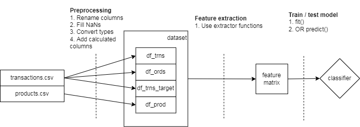

# Библиотека instacartlib

*Программная библиотека на языке Python для предсказания следующего заказа пользователя на основании транзакционных данных Instacart dataset*

1. [Ссылки](#links)
1. [Формат входных и выходных данных](#data-format)
1. [Инструкция для пользователей библиотеки](#manual-user)
1. [Инструкция для ML инженеров](#manual-ml)
1. [Информация для разработчиков библиотеки](#manual-dev)

<a id="links"> </a>

## Ссылки

1. [colab.research.google.com](https://colab.research.google.com/drive/1U7pC87mvlE4Q_9-mI4Y4sVxpKX96Tdtw?usp=sharing)
   * Пример использования в Google Colab

<a id="data-format"> </a>

## Формат входных и выходных данных

**Входные данные** представлены двумя файлами:

1. `transactions.csv` - таблица транзакций сгруппированных по заказам.
1. `products.csv` - таблица с информацией о товарах (id, название, отдел, подразделение).

Пример файлов:

`transactions.csv` (9 полей)

```
order_id,user_id,order_number,order_dow,order_hour_of_day,days_since_prior_order,product_id,add_to_cart_order,reordered
2539329,1,1,2,8,NaN,196,1,0
2539329,1,1,2,8,NaN,14084,2,0
473747,1,2,6,15,15,196,1,1
...
```

`products.csv` (6 полей)

```
iid,department_id,aisle_id,department,aisle,product_name
1,19,61,snacks,cookies cakes,Chocolate San...
2,13,104,pantry,spices seasonings,All-Seasons Salt
3,7,94,beverages,tea,Robust Golden...
...
```

Для экономии места, каждый файл по отдельности может быть упакован в `*.zip` архив.

**Выходные данные** представлены таблицей с двумя колонками:

1. `user_id`: id пользователя.
1. `product_id`: список предсказанных id товаров разделенных пробелом.

`predictions.csv` (2 поля):

```
user_id,product_id
1,196 12427 10258 25133 46149 38928 39657 49235 13032 35951
2,47209 1559 19156 18523 33754 16589 24852 21709 22124 32792
3,39190 47766 43961 21903 17668 18599 16797 48523 32402 22035
...
```

<a id="manual-user"> </a>
## Инструкция для пользователей библиотеки

### Установка библиотеки

```
pip install https://github.com/d-01/instacartlib/archive/main.zip
```

(опционально) Чтобы использовать `CatBoostClassifier`:

```
pip install catboost
```

### Загрузка предобученной модели

```python
from instacartlib import NextBasketPrediction

DATA_DIRECTORY = 'instacart_data'

nbp = NextBasketPrediction(verbose=1)
nbp.add_data(DATA_DIRECTORY)
nbp.load_model('catboost')
```

1. `id='gbc'` (по умолчанию)
1. `id='catboost'` модель CatBoostClassifier дает более точные предсказания и быстрее обучается, но требует установленной библиотеки `catboost`.

### Вывод предсказаний

Получить предсказания по id пользователей:

```python
nbp.get_predictions(user_ids=[20001, 85768])  # DataFrame
```

Экспортировать предсказания для всех пользователей в файл:

```python
nbp.predictions_to_csv('predictions.csv')
# > head -n 4 predictions.csv
# user_id,product_id
# 1,196 12427 25133 10258 46149 39657 38928 35951 13032 49235
# 2,47209 19156 1559 18523 33754 16589 21709 24852 39928 22825
# 3,39190 47766 43961 21903 17668 18599 16797 48523 32402 22035
```

<a id="manual-ml"> </a>
## Инструкция для ML инженеров

### Обучение модели

Загрузка датасета в директорию `./instacart_data/`:

```python
from instacartlib import InstacartDataset, NextBasketPrediction

DATA_DIRECTORY = 'instacart_data'

InstacartDataset(verbose=1).download(to_dir=DATA_DIRECTORY)
```

Обучение классификационной модели с нуля:

```python
from catboost import CatBoostClassifier

model = CatBoostClassifier(verbose=100)

nbp = NextBasketPrediction(model=model, verbose=1)
nbp.add_data(DATA_DIRECTORY)
nbp.train_model()
```

* Модель классификатора должна быть совместима с scikit-learn API.

Cохранение модели:

```python
nbp.save_model('instacart_nbp_model.dump')
```

Загрузка модели из файла:

```python
nbp.load_model(path='instacart_nbp_model.dump')
```

### Feature engineering

Для обучения классификатора и получения предсказаний из таблицы транзакций необходимо сформировать матрицу признаков (features). Колонки матрицы (признаки) формируются с помощью специальных функций-экстракторов (feature extractor).

При формировании матрицы признаков система автоматически подключит плагины (Python-модули) из папки `instacartlib/feature_extractors`, каждый из которых может экспортировать один или несколько экстракторов.

### Система плагинов

Пример плагина для подсчета числа взаимодействий пользователь-товар:

```python
# instacartlib/feature_extractors/000_ui_freq.py

def freq(ui_index, df_trns, df_prod):
    return (df_trns
        .groupby(['uid', 'iid'], sort=False)
        .size()
        .to_frame('freq')
        .reindex(ui_index, fill_value=0)
    )

exports = {'freq': freq}
```

* Требование к плагину: в глобальной переменной `exports` должен быть словарь с экспортируемыми функциями-экстракторами.

### Функция-экстрактор

Функция-экстрактор принимает на вход мультииндекс - список пар (пользователь id, товар id) и датафрейм с транзакциями, и должна вернуть новый датафрейм, в котором индексом будет переданный мультииндекс, а в одной или нескольких колонках рассчитанные признаки для каждой пары пользователь-товар.

Пример:

```python
df_trns = pd.read_fwf(io.StringIO('''
    oid     uid  iord     iid  reord  dow  hour  days_prev  cart_pos
order_A  user_A     1  item_A      0    0     2         -1         1
order_A  user_A     0  item_B      0    0     2         -1         2
order_B  user_A     0  item_A      1    0     2         -1         1
order_C  user_B     1  item_B      0    0     2         -1         1
order_D  user_B     0  item_B      1    0     2         -1         1
'''))

ui_index = pd.MultiIndex.from_tuples([
    ('user_A', 'item_A'),
    ('user_A', 'item_B'),
    ('user_B', 'item_A'),
    ('user_B', 'item_B'),
], names=['uid', 'iid'])


def freq(ui_index: pd.MultiIndex,
         df_trns: pd.DataFrame,
         **kwargs) -> pd.DataFrame:
    return (df_trns
        .groupby(['uid', 'iid'], sort=False)
        .size()
        .to_frame('freq')
        .reindex(ui_index, fill_value=0)
    )

freq(ui_index, df_trns)
#                freq
# uid    iid         
# user_A item_A     2
# user_A item_B     1
# user_B item_A     0
# user_B item_B     2
```

* `freq()` - это функция-экстрактор.

Требования к функции-экстрактору:

1. В первом аргументе принимает индекс и возвращает датафрейм с этим же индексом.
1. В списке параметров должен быть `**kwargs`.
1. Экстрактор не должен менять входные объекты.
1. Экстрактор должен вернуть датафрейм с одной или несколькими колонками:
   1. `columns`: 1 колонка = 1 фича
   1. `index`: берется из первого входного аргумента
   1. Пропущенные заначения (NA, NaN, etc.) не допускаются.

Данные передаваемые в экстрактор:

1. `ui_index` - мультииндекс с парами (пользователь id, товар id)
1. `df_trns` - датафрейм с транзакциями
1. `df_prod` - датафрейм с названиями товаров, отделов и категориями
1. `df_trns_target` - транзакции для целевой корзины (крайний заказ)
   * Этот параметр передается только при формировании тренировочного датасета и нужен для извлечения целевого (предсказываемого) признака.

<a id="manual-dev"> </a>

## Информация для разработчиков библиотеки

### Тесты

Запуск тестов:

```
pytest
```

Покрытие (coverage):

```
pytest --cov --cov-report html
```

Для просмотра отчета в браузере открыть файл `./htmlcov/index.html`.

### Схема пайплайна




1. На первом этапе исходные данные (raw data) проходят предобработку (preprocessing): устанавливаются типы данных, имена колонок, заполняются пропущенные значения, рассчитываются динамические колонки.
1. На втором этапе из данных извлекается матрица признаков.
1. На третьем этапе матрица признаков используется для обучения классификатора или получения предсказаний.

### Назначение модулей

Назначение (responsibility) модулей:

1. `Transactions` -- управление таблицей `transactions.csv`.
   1. Скачивание файла с данными (csv / zip).
   1. Чтение исходных данных в датафрейм.
      1. Фильтрация колонок.
      1. Выбор типов данных.
1. `Products` -- управление таблицей `products.csv`.
   1. Скачивание файла с данными (csv / zip).
   1. Чтение исходных данных в датафрейм.
      1. Фильтрация колонок.
      1. Выбор типов данных.
1. `InstacartDataset` -- центральный API для управления датасетом.
   1. Получение датафреймов с исходными данными с помощь `Transactions` и `Products`.
   1. Формирование и финальная обработка (preprocessing) датафреймов для передачи в функцию-экстрактор.
      1. Именование колонок.
      1. Создание и обновление динамических колонок.
1. `FeaturesDataset` -- генерация user-item датафрейма с фичами.
   1. Менеджмент функций-экстракторов.
   1. Менеджмент списка фичей.
   1. Создание user-item датасета для обучения классификатора методом `fit`.
   1. Создание user-item датасета для выполнения предсказаний методом `predict`.
1. `DataFrameFileCache` -- декоратор для кеширования датафреймов.
1. `feature_extractors` -- импорт функций-экстакторов из плагинов.
1. `transactions_utils` -- функции для работы с транзакционными датафреймами.
   1. Слой изолирующий pandas API.
1. `NextBasketPrediction` -- центральный API для обучения модели и получения предсказаний.
